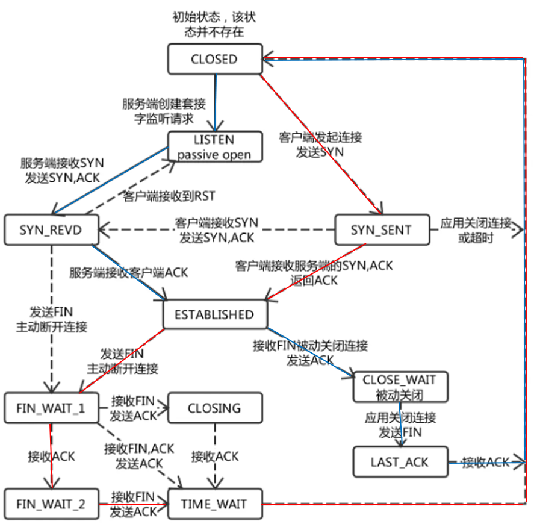
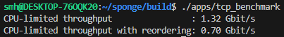

## 重组乱序到达的带序列号的字节流；
定义block为
```cpp
struct block {
    size_t begin_index = 0;
    size_t length = 0;
    std::string bytes{};
};
```

字节流到达后，将它转为block并插入到红黑树（std::set）上，排序方式为序列号的大小。然后对新插入的字节流检查前后block是否可以合并。合并完成后，如果此时红黑树上的最小序列号block可以发送，就将它写入缓冲区。

## 序列号、绝对序列号与流索引间的转换；
|Sequence Numbers	|Absolute Sequence Numbers	|Stream Indices
|:-:                |:-:                        |:-:
|Start at the ISN	|Start at 0	                |Start at 0
|Include SYN/FIN	|Include SYN/FIN	        |Omit SYN/FIN
|32 bits, wrapping	|64 bits, non-wrapping	    |64 bits, non-wrapping
|seqno	            |absolute seqno	            |stream index

除了确保接收所有字节的数据外，TCP还必须确保也接收到流的开始和结束。因此，在TCP中，SYN(流开始)和FIN(流结束)标志都被分配了序列号。

为了提高安全性，避免不同连接之间的混淆，并且确保序列号不能被猜测，不太可能重复。因此，流的序列号不是从0开始的。流中的第一个序列号通常是一个随机的32位数字，称为初始序列号(ISN)。

绝对序列号->序列号：截断后32位

序列号->绝对序列号：和上一次的checkpoint比较，选择最近的一个

在检查TCP段合法后，TCPReceiver将序列号转为绝对序列号，放入重组流中。

## 发送方的超时重传机制；

在发送TCP段时，TCPSender从缓冲区中取出数据，将绝对序列号转为序列号，设置需要的Flag。这个TCP段同时被放入发送队列和等待队列，并开启计时器。当计时器超时后，重发等待队列的第一个TCP段，并将超时时长设置为2倍。当有ack到来时，从等待队列中取出已经被确认的TCP段。

计时器更新规则：
```
发送数据：
if timer is stoped
    timer start

定时器超时：
重传
reset timer
retransmission_timeout *= 2;

收到ACK：
if 等待队列非空
    timer start
```

## 构建TCP的有限状态机，正确地在各种状态下转换。
### TCPReceiver
**LISTEN:** not ackno().has_value()

**SYN_RECV:** ackno().has_value() && !stream_out().input_ended()

**FIN_RECV:** stream_out().input_ended()

### TCPSender
**CLOSED:** next_seqno_absolute() == 0

**SYN_SENT:** next_seqno_absolute() > 0 && next_seqno_absolute() == bytes_in_flight()

**SYN_ACKED:** next_seqno_absolute() > bytes_in_flight() && !stream_in().eof()

**SYN_ACKED(EOF, but FIN not send):** stream_in().eof() && next_seqno_absolute() < stream_in().bytes_written() + 2

**FIN_SENT:** stream_in().eof() && next_seqno_absolute() == stream_in().bytes_written() + 2&& bytes_in_flight() > 0

**FIN_ACKED:** stream_in().eof() && next_seqno_absolute() == stream_in().bytes_written() + 2 && bytes_in_flight() == 0



## 性能测试

